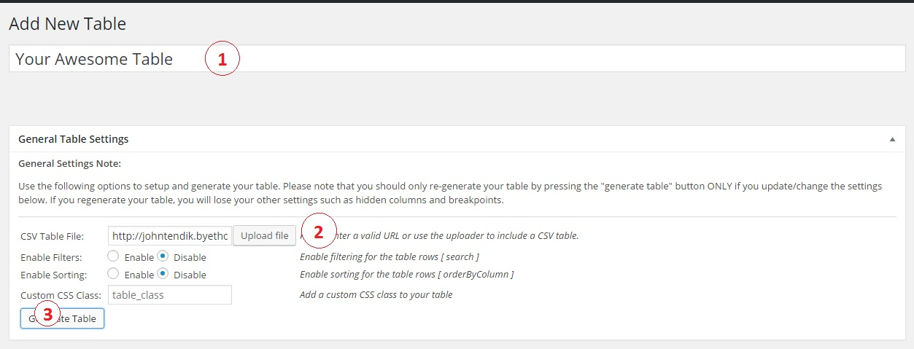
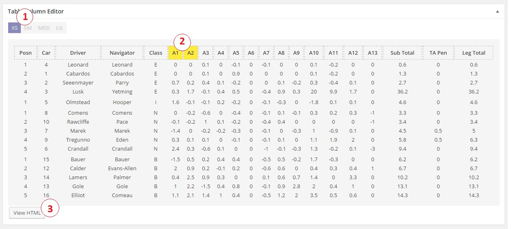
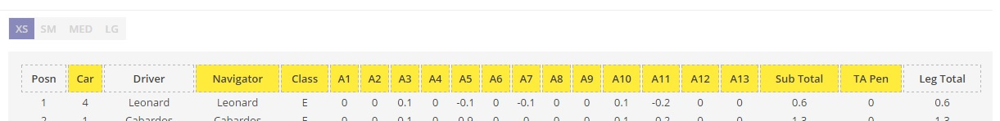
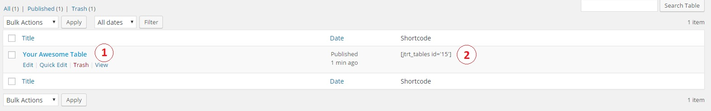
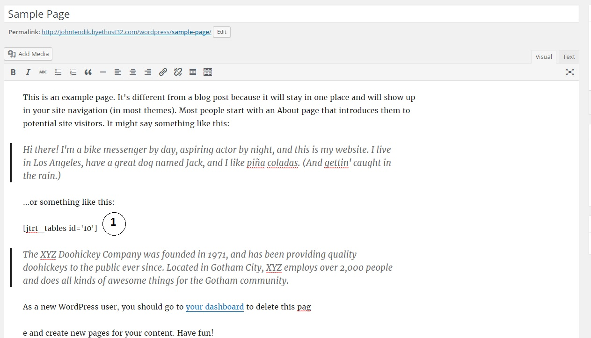
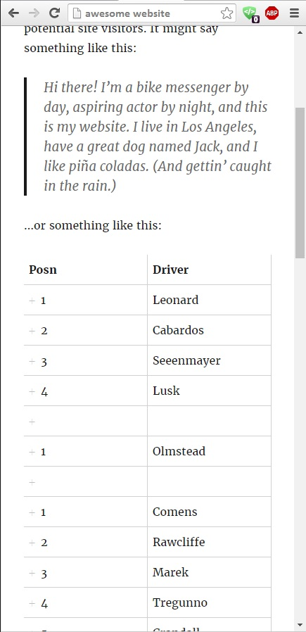

# JTRT Responsive Tables Plugin V 2.0.4!
This is a Wordpress Plugin designed to help users easily create responsive tables in the backend of their website, without having to read or write code. The plugin makes use of CSV table formats to convert it into responsive HTML. It then uses FooTable's engenius responsive scripts to make the html5 behave responsively. 

This update added a few features such as:

1. Simple Backend Table Editor
2. Covert your excel CSV files to responsive html with a few clicks!
3. 4 Custom Breakpoint sizes! (XS SM MD LG)
4. Edit Table cells within the backend!
5. Custom Shortcode, Easy to use!
6. Custom CSS classes for your tables!
7. WIP - Table styler!
8. Table sorting!
9. Table filtering!

Unfortunately, because this update is completely different than the previous 1.3.2 version and uses updated scripts/plugins, this update is not backward compatible with the previous version. 

## Credits up top. The way I roll 
I'm a 21 year old self-taught student who created to plugin to help users easily create responsive tables on their wordpress website. Originally this was a simple personal project but grew to over 300+ active installs. I want to thank each and everyone of you who downloaded and used my plugin, it means a lot and I hope it has served you well. Having said this, I didn't create this plugin entirely from scratch. I made use of amazing frameworks and scripts developed by other amazing people who deserve all the credit for their work. This plugin makes use of other plugins which I have not created or contributed to in any way, I do not take credit for these works, the credits belong to their respective authors. These plugins are: 1. Footable 2. jQuery CSV to Table 3. jQuery 4. Much love to those who helped me with issues, too many awesome people to list, love you all!

### What is Footables?
[FooTable](https://github.com/fooplugins/FooTable/blob/V2/README.md) is a jQuery plugin that transforms your HTML tables into expandable responsive tables. This is how it works:

It hides certain columns of data at different resolutions (we call these breakpoints).
Rows become expandable to reveal any hidden data.
So simple! Any hidden data can always be seen just by clicking the row.

## Setup Instructions
1. Download the jtrt-tables folder onto your computer.
2. Upload the jtrt-tables.zip file into your wordpress plugins page.
3. Activate the plugin in the backend from the plugins page. 
4. Enjoy.

## How To Use
*I will update this area once the video tutorial releases!*

###Step 1: Install/Activate
The first step is to download and activate the plugin, once you do that you will see a new custom post type in the sidemenu

###Step 2: Table Settings

####2.1
As seen in the picture above ( marked #1 ), you can give your table an cool and unique name, this doesn't have any significance other than helping better indentify tables.
####2.2
You can upload a csv table by clicking the upload file button ( marked #2 on the picture above ), your table must be a valid .csv type otherwise the plugin will scream at you. ( you can also directly link to a csv file you have hosted elsewhere, you dont have to use the media upload )
####2.3
Once you have uploaded a csv file, you can give it a custom css class if you wish to target it in your stylesheets easily. 
####2.4 
You can also enable and disable the filter and sorting feature, but once you're satisfied with your settings here, press the generate table button (marked #3 on the picture above) and you will see your table form down below.

###Step 3: Setting Up Your Columns

####3.1
The first thing you should see are four buttons labeled "xs" "sm" "med" "lg", (marked #1 on the pic above) The buttons will toggle different breakpoints for your table so you can hide/show them on the respective breakpoints.
####3.2
The first button is already selected which is the "xs" breakpoint, your job is to select which columns you want to *hide* on the xs breakpoint (smallest screen). You can do this by clicking on the headers of your table and they will turn yellow (marked #2 on the picture above). 
####3.3
Yellow headers means that column will hide on the set breakpoint. For example, the picture below, only the columns "Posn", "Driver" and "Leg total" will show up on the "xs" breakpoint.

###Step 4: Skip The Styles
Skip the styles section entirely, this was an error on my part and a work in process feature crept its way into the release. It doesnt work, and its horrible. I haven't updated it. Use at your own risk. Beware! caution! danger! 

###Step 5: Save Your Table
Once you're happy with your set columns, save your table and head back to the "all tables" page and you will see your awesome new table there.

###Shortcode
Your shortcode is located on the side, (marked #2 on the picture above) simply copy paste this code into your new page or post.

###Step 6: Use Your Shortcode

Add your shortcode to your page or post like shown above, save your post and your new table will be ready for you on the front end.

###Step 7: Profit

## Planned Features For The Future

1. update styles, holy cow it sucks
2. better ux please
3. data-type for columns
4. pagination
