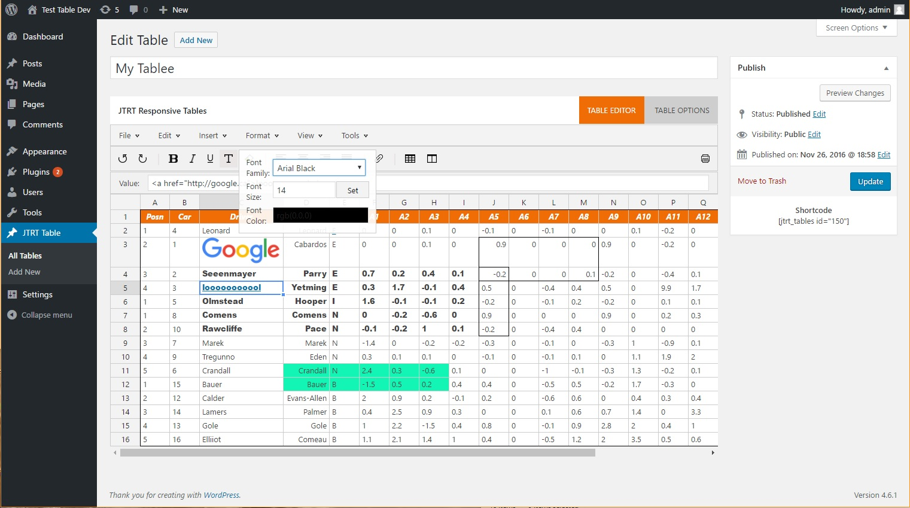

# SUPPORT IS NO LONGER AVAILABLE FOR THIS PROJECT
# If you want to take this over, please contact me =)

# Docs
If you're here for the older version docs, they are now located on their own branch.

0. [Version 1.3.2](https://github.com/JohnTendik/jtrt-tables/tree/Version-1.3.2-Legacy-%5D)
1. [Version 2.0.4](https://github.com/JohnTendik/jtrt-tables/tree/Version-2.0.4-Legacy%5D)

# JTRT Responsive Tables Plugin V4!
This is a Wordpress Plugin designed to help users easily create responsive tables in the backend of their website, without having to read or write code. You can start building your table from scratch or import a CSV file to get started.

This update added a few features such as:

0. The best table editor. 
1. Edit cell fonts, color, size
2. Edit cell borders, font-styles, font-decoration
3. Custom cell alignments
4. Multi select/edit
5. keyboard shortcuts (ctrl + c, ctrl + z, etc)
6. Cell backgrouns colors
7. Sorting in the backend
8. Insert images using the wordpress media uploader
9. Import CSV/TSV/
10. Export to CSV
11. Print talbe
12. Find and replace in your table
13. 3 different responsive options (scroll, column hiding, column stacking)
14. Custom hover highlight colors for rows and columns
15. Easily filter out rows/columns by using the new shortcode attributes filterrows and filtercols 
16. Support for HTML tags
17. UNDO + REDO Support
18. Context menu for easy table editting (right click)
19. Read only cells 
20. Pagination, sorting and filtering in the front-end

### Update Notice 
Unfortunately, because this update is completely different than the previous 3 versions and uses updated scripts/plugins, this update is not backward compatible* with the previous version. If you already have tables you created with the earlier versions of this plugin, you will need to recreate them with this version*. I have included a "converter" for this update, so if you're upgrading from v3 to v4 you may be able to use the option provided in the plugin. If you have previous tables the plugin will detect this and ask you if you want to convert your data to be compatible with v4. This doesn't work 100% of the times, so your table may appear broken. Fixing it should be pretty easy I'm hoping. If you click the "don't show me this message again" you will never see the message again but your table will be deleted from the old database(its worthless it didn't even work properly) so be warned. 

## Credits up top. The way I roll 
I'm a 22 year old self-taught student who created this plugin to help users easily create responsive tables on their wordpress website. Originally this was a simple personal project but grew to over 1000+ active installs!!! I want to thank each and everyone of you who downloaded and used my plugin, it means a lot and I hope it has served you well. Having said this, I didn't create this plugin entirely from scratch. I made use of amazing frameworks/scripts developed by other amazing people who deserve all the credit for their work. This plugin makes use of third party scripts which I have not created or contributed to in any way, I do not take credit for these works, the credits belong to their respective authors. These plugins are: 

* Handsontable
* Footable 
* PapaParse 
* jQuery 
* Colorpicker.js
* Datatables
* Freepik for the icons <3
* Much love to those who helped me with issues, too many awesome people to list, love you all!

### What is Footables?
[FooTable](https://github.com/fooplugins/FooTable/blob/V2/README.md) is a jQuery plugin that transforms your HTML tables into expandable responsive tables. This is how it works:

It hides certain columns of data at different resolutions (we call these breakpoints).
Rows become expandable to reveal any hidden data.
So simple! Any hidden data can always be seen just by clicking the row.

## Setup Instructions
###### Installing With Wordpress
0. Navigate to the plugins directory
1. Locate JTRT responsive tables plugin
2. Install and Activate

###### Installing Through FTP
0. Download the contents of this git onto your computer.
1. Create a folder in your wordpress/wp-content/plugins directory called "jtrt-responsive-tables"
2. Upload the files you downloaded from Github inside the newly created folder "jtrt-responsive-tables" 
3. Activate & Enjoy.

## How To Use Video Tutorial
Updated video coming soon, hopefully.

## How To Use Written Tutorial

### Step 1: Add New Table
Assuming you've already activated the JTRT responsive tables plugin, click the "add new" button located inside the new JTRT Tables menu

##### Edit your table to your liking. 

The UI should look familiar hopefully to what you're used to. If you have any questions or feedback please contact me. 

### Step 2: Choose Your options

###### Show Table Title
If enabled, your table title will apear in the front end. 

###### Table Title Position
Show Table Title needs to be enabled. These are the positions available for your title 
* Top Left, Center, Right
* Bottom Left, Center, Right

###### Responsive Styles
* Scrolling
  * This option is usually the least responsive, this will add a scroll bar to your table if it excedes the table width
* Column Hiding
  * This is the footable option. If the video is released please watch that to get an idea of how this option works or read through the [footable documentation.](https://github.com/fooplugins/FooTable)
* Column Stacking
  * This option will turn your table rows into block content when the size of the table is below the given pixel ( you can set this yourself the default is 500px )
  
###### Filtering
This will add a search box in the front end so your users who see the table will be able to search through the table

###### Sorting
This will allow your users to sort the table data by the columns. Note however if you're using the footable responsive option, you need to also specify the column type (text,html,number,date).
###### Pagination
If your table has a lot of rows, this option will break up your table into pages so your table doesn't stretch the page out

###### Row Highlighting 
If enabled, when a user hovers over your table rows, the set color will be applied to the cells

###### Column Highlighting
Same as above but for columns.

###### Shortcode Row Filter Option
* [jtrt_tables id="1" filterrows="3,5,6" filtercols="2"]

By using the new shortcode attributes, you can easily filter out rows or columns without having to edit your table. This is so if you want to display the same table multiple times with different columns or rows showing. filterrows="3,5,6" will filter out rows 3,5, and 6. The attributes expect a string with the row/col numbers separated by commas. 

### Insert Your Code
Copy your shortcode, located underneath the save button and paste it anywhere in your website such as in widgets,pages,posts,product descriptions, etc. 

### Step 9: Profit

## Planned Features For The Future

0. Grapghs? 
1. Functions/Formulas?
2. Border width + color?
3. Cell types? (date,select,etc)
4. More Styles? 
