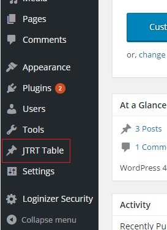
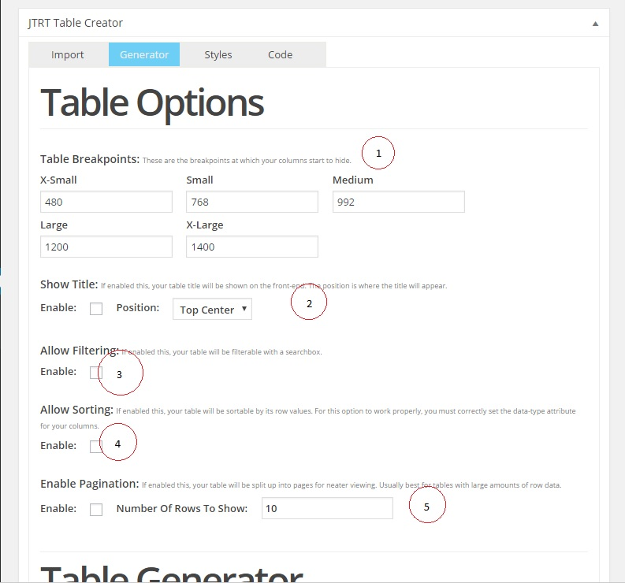

# Docs
If you're here for the older version docs, they are now located on their own branch.

1. [Version 1.3.2](https://github.com/JohnTendik/jtrt-tables/tree/Version-1.3.2-Legacy-%5D)
2. [Version 2.0.4](https://github.com/JohnTendik/jtrt-tables/tree/Version-2.0.4-Legacy%5D)

# JTRT Responsive Tables Plugin V3!
This is a Wordpress Plugin designed to help users easily create responsive tables in the backend of their website, without having to read or write code. You can start building your table from scratch or import a CSV file to get started.

This update added a few features such as:

1. Simple Backend Table Editor
2. Covert your excel CSV files to responsive html with a few clicks!
3. 5 Custom Breakpoint sizes! (XS SM MD LG)
4. Edit Table rows/columns 
5. Add/delete/move columns or rows
7. WIP - Table styler!
8. Table pagination
9. 10 sample styles

### Update Notice **
Unfortunately, because this update is completely different than the previous 2 versions and uses updated scripts/plugins, this update is not backward compatible with the previous version. If you already have tables you created with the earlier versions of this plugin, you will need to recreate them with this version. "It will be worth it, trust me" - Trump

## Credits up top. The way I roll 
I'm a 22 year old self-taught student who created this plugin to help users easily create responsive tables on their wordpress website. Originally this was a simple personal project but grew to over 600+ active installs!!! I want to thank each and everyone of you who downloaded and used my plugin, it means a lot and I hope it has served you well. Having said this, I didn't create this plugin entirely from scratch. I made use of amazing frameworks/scripts developed by other amazing people who deserve all the credit for their work. This plugin makes use of third party scripts which I have not created or contributed to in any way, I do not take credit for these works, the credits belong to their respective authors. These plugins are: 
* Footable 
* PapaParse 
* jQuery 
* Jquery Sortable
* Much love to those who helped me with issues, too many awesome people to list, love you all!

### What is Footables?
[FooTable](https://github.com/fooplugins/FooTable/blob/V2/README.md) is a jQuery plugin that transforms your HTML tables into expandable responsive tables. This is how it works:

It hides certain columns of data at different resolutions (we call these breakpoints).
Rows become expandable to reveal any hidden data.
So simple! Any hidden data can always be seen just by clicking the row.

## Setup Instructions
###### Installing With Wordpress
1. Navigate to the plugins directory
2. Locate JTRT responsive tables plugin
3. Install and Activate

###### Installing Through FTP
1. Download the contents of this git onto your computer.
2. Create a folder in your wordpress/wp-content/plugins directory called "jtrt-responsive-tables"
3. Upload the files you downloaded from Github inside the newly created folder "jtrt-responsive-tables" 
4. Activate & Enjoy.

## How To Use
** Coming Soon ** 

### Step 1: Add New Table
Assuming you've already activated the JTRT responsive tables plugin, click the "add new" button located inside the new JTRT Tables menu

### Step 2: Import Or Start From Scratch

Give your table a name if you want (you can choose to display this title in the front-end). Next, you can start your table from scratch and begin editting rows/columns, OR you can import a CSV file from your computer. If you choose to import a CSV file, make sure that it's extension is .csv (comma separated values)

### Step 3: Setting Up Your Table

#### 3.1
###### Table Breakpoints ( #1 in the pic above )
Each table can now have it's own breakpoints. You have 5 breakpoints to choose from. These are the screen sizes at which your table begins to hide columns. 

#### 3.2
###### Table Title ( #2 in the pic above )
You can choose to display your table title in the front-end at the top of your table. 

#### 3.3
###### Table Filtering ( #3 in the pic above )
If you enable table filtering, your table will have a seachbox that you can use to filter table results. 
###### Table Sorting ( #4 in the pic above )
If you enable table sorting, your table will be sortable based on the headers. Please note, if you enable this feature, you need to properly set your column "data-type" attribute for the sorting to properly work. 
###### Table Pagination ( #5 in the pic above )
If your table has a lot of rows and you want to save up space, you can break up your table into different pages. 

### Step 4: Table Generator

#### 4.1
###### Column Headings ( #1 in the pic above )
These column headings labeled "a-z" will not show up on your table. They are helper headers. If you hover over these, they will turn BLUE indicating that you can click it. You can click these column headers to edit your table columns. (see picture #5 below)
###### Table Headers ( #2 in the pic above )
This is the header of your table, you cannot delete this row. *tip*: If you hover over these headers, your cursor will change to a move icon. You can click and drag on your table headers to re-arrange them in the backend.
###### Row Headings ( #3 in the pic above )
Similar to the column headings, if you click on these buttons you can edit the specified row. 
###### Add Row/Columns ( #4 in the pic above )
These green buttons will allow you to add a row or a column to your table. So if you want to add data, you can do so easily by clicking on these buttons. 

### Step 5: Column Options
Once you click on the Column headings to edit your columns, you will be greeted with the following pop-up:

#### 5.1
###### Column Type (#1 in the pic above)
If your column has any images, links, buttons or html, you can use this select box to change your column data type to HTML so that your table will work properly. Also, if you're using the table sorting feature, you need to make sure your column type is correctly set to match the data inside the column. 
###### Hiding Columns (#2 in the pic above)
These buttons correspond to the breakpoints for your table. So if you want the column to hide on the xs and sm breakpoints, then you would simply click the xs and sm buttons. They will highlight blue indicating that you've selected these breakpoints to hide the column. Also, once you start hiding columns you will notice table headers will turn red, this is nothing to worry about its just an indication that you've made that column responsive. 
###### Editting Columns (#3 in the pic above)
You can edit your table values here. Note, if you make any changes to the values, you need to click the blue "save changes" button for the changes to take effect. 
###### Deleting Columns (#4 in the pic above)
You can also delete a column if you want to remove it entirely. This will remove the entire column, so be warned!

### Step 6: Styles

#### Styling Options (#1 in the pic above)
You have 3 choices as of now for the styling of your table.
* Inherit
* Bootstrap
* Example

###### Inherit 
If your wordpress theme already supplies styles for tables, then this is the best option if you want a consistent feel and flow. Your table will automatically use your theme styles so it matches the rest of your website's brand.
###### Bootstrap 
If you want a simple, clean and neat table layout then bootstrap styles is your friend! You can chose to add default bootstrap features such as row highlighting, zebra stripes, etc. 
###### Example Styles 
These are some example styles to demonstrate the possibilities. These will still style your table in the front-end. There are 10 different varying styles, not all of them will work nicely with all table types so try them out and see which works best with your table. My plan is to add a custom styles section to the plugin so users can style their tables freely. Coming soon :D

### Step 7: Codeeeeeee

We're nearing the end of the guide. When you're happy with your column types/breakpoints/styles you can view your shortcode in the next tab. You can also view your HTML code for your table if that interests you. Please note, if you're using the HTML code then you need to generate your table code each time you make a change. If you're using the shortcode, the changes are automatically updated. 

### Step 8: Adding Your Table to Your Website

Simply copy paste your HTML code into your page/post. Or better yet, copy paste the shortcode instead. You can use either method, your breakpoints,styles and column types will all work either way. 

### Step 9: Profit

## Planned Features For The Future

1. I'm open to suggestions
